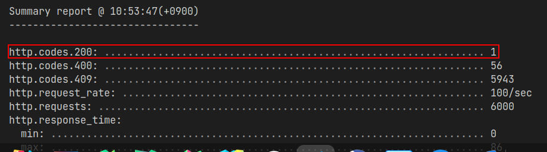
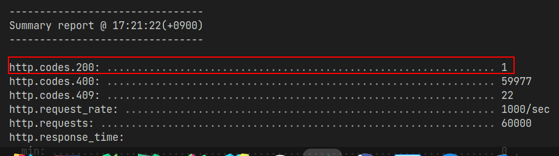
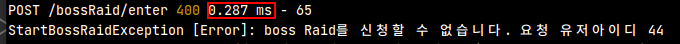

# raid

<p align="center">
    <h1 align="center">
        Raid Ranking API
    </h1>
    <p align="center">게임 보스 레이드 랭킹 정보를 알려주는 API입니다<a href="https://github.com/dimsssss/raid"></a>.</p>
</p>

<p align="center">
    <a href="">
        
    </a>
    <a href="">
        
    </a>
    <a href="https://expressjs.com/">
        
    </a>
    <a href="https://jestjs.io/">
        
    </a>
    <a href="https://sequelize.org/">
        
    </a>
    <a href="https://dl.circleci.com/status-badge/redirect/gh/dimsssss/raid/tree/main">
        
    </a>
</p>

## 🏗 프로젝트 설명

## 프로젝트 레이어 계층 분리

프로젝트 디렉터리 구조를 어떻게 나눌까 생각을 하다가 나누는 최소 단위를 도메인으로 결정하였다. 내가 아는 방법으로는 역할로 나누는 방법과 도메인으로 나누는 방법이 있는데 각각 특징이 있다. 확장성을 고려해서 나는 도메인 단위로 레이어를 분리하였다

### 역할 별 레이어 분리

웹 프로젝트는 크게 controller, service, repository로 나눌 수 있다. 이 구조로 프로젝트를 구성하면 위 3가지 요소 마다 각각의 디렉터리를 만들고 같은 종류의 파일을 갖는다. 이러한 구조를 레이어드 아키텍처, n-tier 아키텍처라고 한다.(이제부터 n-tier 아키텍처라고 지칭한다)

n-tier라고 하는 것은 계층의 수가 정해진게 아니고 계속 추가될 수 있다는 의미다. 레이어 수가 다른 여러 개의 n-tier 프로젝트가 있을 때 같은 n-tier라고 할 수 있는 이유는 공통적으로 위의 3계층을 꼭 포함하고 있는 것이다.

하나의 레이어는 다른 레이어에 단방향으로 의존을 한다. 컨트롤러는 서비스에 의존하고 서비스는 데이터베이스에 접근하는 DAO에 해당하는 리포지터리에 의존한다. 단 하나의 예외도 없이 동일해야하고 하나의 레이어가 추가 된다면 모든 기능에 레이어를 적용해야 한다.

내가 생각한 단점은 여기에 있다. 어떤 기능을 구현할 때 사용하지 않는 레이어가 있어도 무조건 해당 레이어를 구현해야 하는 것은 비효율적이다. 그 밖에 다른 특징들은 아래의 문서를 참고하면 좋다

[Software Architecture Patterns](https://www.oreilly.com/library/view/software-architecture-patterns/9781491971437/ch01.html)

### 도메인 별 레이어 분리

DDD 아키텍처라고 하는 디렉터리 구조다. 하나의 시스템이 구성하는 각각의 도메인 별로 디렉터리 구조를 나눈다. 각 디렉터리는 내부적으로 presentation(controller), domain(model), infra(외부 시스템), application(서비스)의 계층을 갖는다.

DDD는 마이크로서비스 아키텍처에서 언급된다.

시스템을 잘 설계했다면 하나의 도메인을 떼어내서 서비스할 수 있다. 마이크로서비스 아키텍처에서 DDD가 언급되는 이유다.

도메인에서도 여러 부분에 포함되는 도메인이 존재하는데 bounded context라고 지칭한다. 쇼핑몰 서비스에서 상품은 그 자체로 서비스로 사용할 수 있고 창고, 물류 도메인에서는 수량을 나타낼 수 있다. 다른 도메인에서 약간씩 다르게 적용해야하는 도메인이다

DDD 아키텍처를 선택하면 마이크로서비스 아키텍처를 구현하는데 수월하다

## 캐시 적용

보스 레이드를 성공하면 레이드 레벨에 맞는 점수를 얻는다. 랭킹 API는 유저 별 레이드 점수의 총합으로 순위를 정한다. 요구사항을 보면 보스를 레이드 하는 시간은 3분만 허용한다. 3분마다 한번씩만 시도할 수 있고 레이드를 성공해야 랭킹이 변경된다. **ranking이 변동되는 경우보다 현재 rankig을 불러오는 작업이 더 많을거라 예상을 했다**.

랭킹은 데이터베이스에서 sum을 이용해서 구하기 때문에 데이터가 많아질수록 구하는 시간이 오래걸린다. 변동은 자주 없으며 구하는데 시간은 오래 걸리고 자주 요청되는 상황, 캐시를 사용하면 좋은 상황이다.

### Redis

랭킹 데이터를 서버에서 캐싱을 하다가 서버가 죽어버리면 캐싱이 무효화된다. 서버에 좌지우지 되는 상황이어서 분리하는 것이 안정적이다

in-memory 저장소 기술 가운데 redis를 선택하였는데 이유는 사용자가 많아서이다. ‘사용자가 많다’는 상대적으로 다른 기술보다 안전이 보장되고 자료가 풍부하다는 것을 의미한다. 서비스 운영중에 가장 안좋게 생각하는 경우는 사용하는 기술이 기술 지원이 끊기거나 오픈 소스라면 커뮤니티 활동이 저조하고 자료가 없는 것을 가장 안좋게 생각한다.

memcached도 많이 사용하지만 내 기준에는 redis가 더 좋았다. 둘의 차이는 아래 글에 나와있다

[Redis vs. Memcached | AWS](https://aws.amazon.com/ko/elasticache/redis-vs-memcached/)

## Sequelize 아쉬운 점

row_number라는 mysql 함수를 사용하려고 하는데 내가 의도한 sql문으로 변환을 하지 않는다.

```jsx
// fn('mysql 함수 이름', '함수에 적용될 컬럼 이름')
Sequelize.fn(`ROW_NUMBER() OVER`, Sequelize.col('ORDER BY totalScore')),
```

위와 같이 ORDER BY 키워드가 같이 들어가야 하는 경우에 sql syntax 에러를 내뿜는다. 직접 쿼리를 작성해서 해결하였다

또 하나의 아쉬운점은 공식문서가 정확하지 않다. 동시성 처리를 위해서 공식 문서 내용대로 optimistic lock을 설정했지만 동작하지 않는다. 직접 lock을 걸어서 해결해야했다

## 비동기 작업 타이밍 맞추기

초기에 Boss state 정보를 가져와야 웹 서버가 실행하게 하고 싶다. raid가 진행중인 상황에서 갑작스런 장애로 서버가 재시작 한다면 데이터 정합성을 위해서 현재 bossState를 가져와서 다시 캐싱을 해야한다

boss state 정보는 https 통신으로 가져오는데 non-blocking으로 동작을한다. 서버를 초기화하는 도중에 non-blocking으로 진행이 되어서 데이터를 가져왔는지 아닌지 확인이 안된 상태에서 서버가 가동되고 있는 상황이다.

nodejs 비동기 처리 기능을 생각해보다가 Promise.all 메서드가 생각났다. promise 배열을 인자로 받고 모든 프로미스가 실행이 끝나면 callback으로 처리할 수 있다. 만약 하나라도 실패한다면 reject로 처리한다.

```jsx
Promise.all([externalAPIPromise, redisInitPromise]).then(async result => {
  const [bossState, redis] = result
  const bossRaidCache = {}
  await bossStateAPI.setBossStateTo(bossRaidCache, bossState, redis)

  const port = createServer(app)
  app.set('port', port)
  app.set('bossRaidCache', bossRaidCache)
})
```

## 부하테스트

요구 조건 가운데 하나는 한번에 한명만 보스 레이드를 진행할 수 있는 것이다. 보스 레이드 입장 API가 동시성 문제가 발생할것 같아서 두 가지 lock을 고려해보았다

### 비관적락

트랜잭션이 충돌한다고 가정하고 먼저 락을 걸어버리는 기법이다. 데이터베이스가 지원하는 `select … for update` 키워드를 이용하여서 락을 제어한다.

비관적락은 요청을 rollback하지는 않기 때문에 현재 상황에서 사용하기는 어렵다. 여러명이 동시에 요청하면 순서대로 진행해야하는 것이 아니라 한명만 진행되고 나머지는 취소해야하기 때문이다

### 낙관적락

개발자가 어플리케이션에서 트랜잭션 충돌을 처리하는 기법이다. 비관적 락과는 다르게 트랜잭션 예외를 일으키거나 rollback으로 취소할 수 있다. 여러 명의 요청을 순서에 맞게 처리하는 것이 아니라 **최초의 커밋만을 인정**해야하기 때문에 현재 상황에 적절한 방법이다.

현재 데이터베이스 구조가 유저의 보스 레이드 기록을 쌓아두는 테이블과 유저 테이블만 존재한다. 낙관적락을 구현하기 위해서 bossState라는 테이블을 만들고 state라는 컬럼으로 현재 레이드가 가능한지 아닌지를 확인한다.

### 결과



동시 사용자 100명으로 부하테스트



동시 사용자 1000명으로 부하테스트

### 더 생각해볼 부분

한 명의 유저가 레이드를 시작하면 3분간 모든 레이드 요청을 막아야한다. 현재 레이드 가능 여부를 데이터베이스를 확인해서 요청을 막는다. 데이터베이스까지의 조회는 네트워크를 타고 진행을 하기 때문에 비용이 비싸다. 한명만 입장을 하면 3분 동안은 결과는 동일하므로 데이터베이스를 조회할 필요가 없다.

bossState라는 객체에 입장 가능여부를 캐싱해 놓고 같은 API가 들어오면 데이터베이스 조회 대신 바로 입장불가 응답을 보냈다



만약 redis로 저장을 하면 어떻게 될것인가. 둘다 저장소가 원격일 경우 네트워크 동작을 하지만 redis는 메모리에 저장을 하고 데이터베이스는 파일에 저장을한다. 파일 입출력보다는 메모리 접근이 빠르기 때문에 단순 계산으로는 레디스로 저장을 하는 것이 성능에 도움이 될것 같다.

## 🌐 API Document

https://app.swaggerhub.com/apis-docs/dimsssss/raid-api/1.0.0

## 🧾 실행

```shell
npm run dev
```
